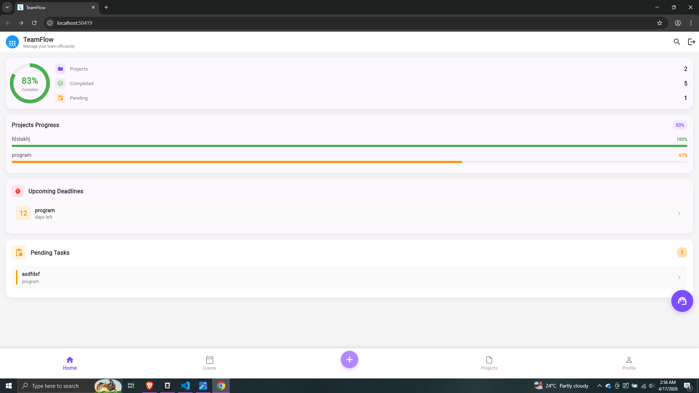

# 🚀 TeamFlow – Project & Team Management App

## 📌 Overview

TeamFlow is a mobile application built using Flutter that helps teams manage projects, tasks, and events efficiently. It provides a structured workflow for tracking progress, assigning responsibilities, and scheduling meetings with automated reminders.

The app combines project management, task tracking, and event scheduling into a single, user-friendly interface.

---

## 🎯 Features

### 📁 Project Management

* Create and manage multiple projects
* Add and manage team members
* Set project deadlines

### ✅ Task Management

* Create, update, and delete tasks
* Assign tasks to team members
* Set priorities (Low, Medium, High)
* Track task completion status
* Filter tasks (completed, pending, priority-based)

### 📅 Event Scheduling

* Schedule meetings/events linked to projects
* Automatic reminders before events
* Notify team members about upcoming meetings

### 🔔 Notifications

* Local notifications for:

  * Event reminders
  * Project deadlines
* Instant alerts for important updates

### 💾 Data Persistence

* Stores projects and events locally
* Uses JSON serialization and SharedPreferences

### 🔐 Authentication (Mock)

* Google, Facebook, and X login options
* Simulated authentication flow

### 🎨 UI/UX

* Clean and modern interface
* Light and dark theme support
* Dashboard with progress tracking

### 🤖 Smart Assistant (Bonus Feature)

* Command-based assistant to:

  * Create projects
  * Add tasks
  * Schedule meetings
* Natural input examples:

  * "Create project AI System"
  * "Add task Design UI in ProjectX"
  * "Schedule meeting tomorrow at 2 PM"

---

## 🏗️ Architecture

The application follows a modular structure:

```id="arch1"
lib/
├── models/        # Data models (Project, Task, Event)
├── services/      # Business logic (Auth, Storage, Notifications)
├── screens/       # UI screens
├── widgets/       # Reusable UI components
└── main.dart      # Entry point
```

---

## ⚙️ Technologies Used

* Flutter (Dart)
* Provider (State Management)
* SharedPreferences (Local Storage)
* Flutter Local Notifications
* JSON Serialization

---

## 🚀 How to Run

1. Clone the repository:

```id="runf1"
git clone https://github.com/your-username/teamflow-flutter-app.git
```

2. Navigate to the project:

```id="runf2"
cd teamflow-flutter-app
```

3. Install dependencies:

```id="runf3"
flutter pub get
```

4. Run the app:

```id="runf4"
flutter run
```

---

## 📸 Screenshots

(Add screenshots here after uploading)

```id="img1"



```

---

## 💡 Key Highlights

* Full-featured project management system
* Real-time task tracking and filtering
* Event scheduling with automated reminders
* Integrated assistant for command-based interaction
* Clean UI with multiple screens and navigation

---

## ⚠️ Limitations

* Authentication is mocked (no real backend)
* Data stored locally (no cloud sync)
* Limited multi-user collaboration

---

## 🔮 Future Improvements

* Firebase / backend integration
* Real-time team collaboration
* Cloud synchronization
* Push notifications
* Role-based access control

---

## 👤 Author

Shahriar Kobir Sabbir
CSE Graduate | Aspiring Machine Learning Engineer

---
